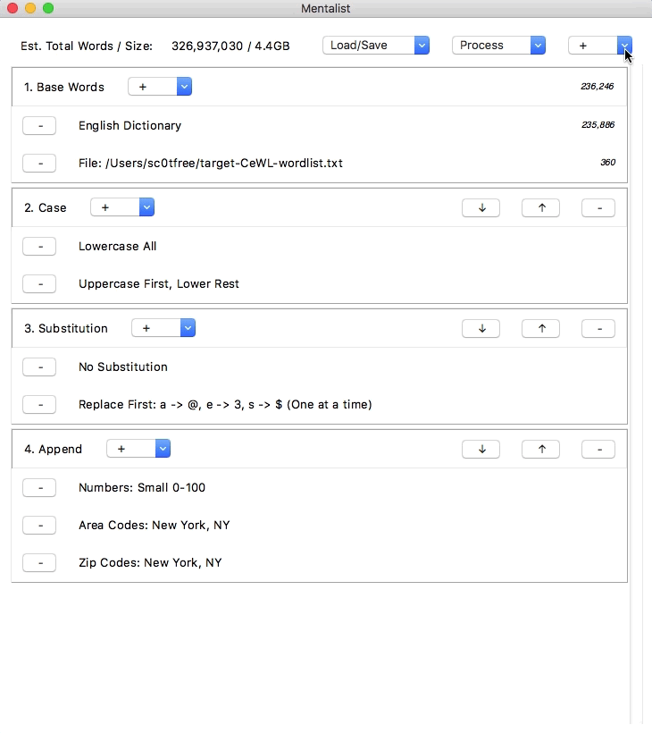

[](https://twitter.com/sc0tfree)

# Mentalist
<p align="center">
  
</p>
<br>

Mentalist is a graphical tool for custom wordlist generation. It utilizes common human paradigms for constructing passwords and can output the full wordlist as well as rules compatible with [Hashcat](https://hashcat.net/hashcat) and [John the Ripper](http://www.openwall.com/john).
<br>

For more information on installing and using Mentalist, please **[visit the wiki](https://www.github.com/sc0tfree/mentalist/wiki)**.

<br>
<p align="center">
  
</p>

**Prebuilt executables** are available for [v1.0](https://github.com/sc0tfree/mentalist/releases/tag/v1.0) (Python 3.6-3.10 only). For v2.0+ with Python 3.11+ support, use Poetry or pip installation below.

## Installation

**IMPORTANT:** Version 2.0+ requires Python 3.11 or higher. If you need to use an older Python version, please use [Mentalist v1.0](https://github.com/sc0tfree/mentalist/releases/tag/v1.0).

### Prerequisites

Mentalist requires **tkinter** (Python's standard GUI library). While tkinter is included with Python, the underlying Tcl/Tk libraries may need to be installed separately depending on your system.

**macOS (Homebrew Python):**
```bash
# Install python-tk matching your Python version
brew install python-tk@3.13  # For Python 3.13
brew install python-tk@3.12  # For Python 3.12
brew install python-tk@3.11  # For Python 3.11

# Verify tkinter is available
python3 -c "import tkinter; print('✓ Tkinter is ready')"
```

**Linux (Debian/Ubuntu):**
```bash
sudo apt-get install python3-tk
```

**Linux (Fedora/RHEL):**
```bash
sudo dnf install python3-tkinter
```

**Windows:**
Tkinter is included with the official Python installer from python.org - no additional installation needed.

### Using Poetry (Recommended)

```bash
# Install Poetry if you haven't already
curl -sSL https://install.python-poetry.org | python3 -

# Clone and install Mentalist
git clone https://github.com/sc0tfree/mentalist.git
cd mentalist
poetry install

# Run Mentalist
poetry run mentalist
```

### Using pip

```bash
# Clone the repository
git clone https://github.com/sc0tfree/mentalist.git
cd mentalist

# Install Mentalist
pip install .

# Run Mentalist
python -m mentalist
```

### Development

```bash
# Install with Poetry
poetry install

# Run tests
poetry run pytest

# Build distribution packages
poetry build
```

### Building Standalone Executable

You can create a standalone executable using PyInstaller:

```bash
# Install PyInstaller (add to dev dependencies)
poetry add --group dev pyinstaller

# Build the executable
poetry run pyinstaller mentalist.spec

# The executable will be in the dist/ directory
```

## Disclaimer

Mentalist should be used only for **informational purposes** or on **authorized system audits**. _Do not use this tool to aid in illicit access to a system._

## License and Contributions

Mentalist is under the MIT License.

Contributions are always welcomed! Please let me know if there's a specific piece of functionality that you'd like to see built-in to the next version of Mentalist.

## Thanks

A special thanks to Craig Baker, who was instrumental in helping to develop the backend logic of Mentalist. Additionally, thank you to Shane Carlyon, whose Tkinter-fu was invaluable, and to Gregory Brewer, who contributed the artwork to this project.

## Note on ‘Slang and Expletives’ List

I apologize to anyone offended by the built-in list of `Slang & Expletives`, compiled from a variety of sources. The reality is that some people use truly heinous words for their credentials and this list is meant to help crack them.

## Future Work

* Ability to scrape sites as an attribute in the Base Words node.
* Add dictionaries and lists for more languages
* Add UK post codes to Append/Prepend Nodes
* Option to perform de-duplication of Base Words
* Mentalist Chain file differencing